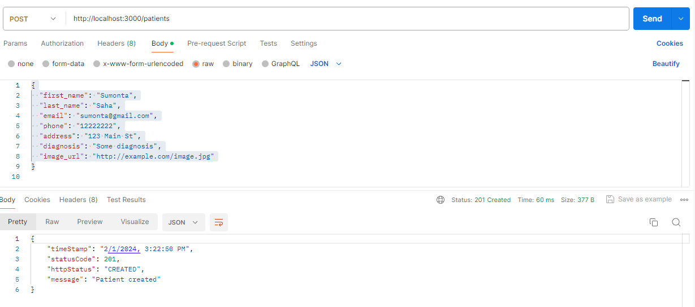

<div align = "center">

## 🧠 Team Name : YOUR WORST NIGHTMARE


*------ **🧠 Tutorial NodeJS API with mySQL and Docker 🧠** ------*

#### ✍️ NodeJs API, mySQL and Docker Tutorial  :  **([👉 Video Link](https://youtu.be/8L3zwbnPugs?si=TcPRBw3TfebEBC57))** **([👉 Code Link](https://github.com/getarrays/nodejsapi/blob/master/src/controller/patient.controller.js))**

<hr>
</div>


## 🌲 Run The Project using Docker Container

-  **👉 Check any Container Running**
```
docker ps  -a
```
-  **👉 Run All Container**
```
docker-compose up -d --build
```
-  **👉 Check All Container Running**
```
docker ps
```

## 🌲 Check My SQL Database and Table

-  **👉 Set SQL Path**
```
set path=%PATH%;C:\xampp\mysql\bin;
```
-  **👉 Open MySQL**
```
mysql -h localhost -P 3306 --protocol=tcp -uroot -pletmein
```
-  **👉 Show All Databases**
```
 SHOW DATABASES;
```
-  **👉 Go To Database patientsdb**
```
 USE patientsdb
```
-  **👉 Show all table under patientsdb database**
```
SHOW TABLES;
```
-  **👉 Check Patients Table**
```
SELECT * FROM patients;
```
-  **👉 Insert Data in Patients Table**
```
 INSERT INTO patients (first_name, last_name, email, phone, address, diagnosis, image_url)
VALUES ('Alexandre', 'Petion', 'mridl@gmail.com', '222-555-6458', '123 Main Road', 'Cough', 'https://profileimage.com');
```
-  **👉 Check Patients Table**
```
SELECT * FROM patients;
```
-  **👉 Check Coords Table**
```
SELECT * FROM coords;
```
-  **👉 Insert Data in Coords Table**
```
INSERT INTO coords (x, y)
VALUES (10, 20);
```
-  **👉 Check Coords Table**
```
SELECT * FROM coords;
```

## 🌲 Check API Documentation

-  **👉 GET APIs**
```
http://localhost:3000
```
```
http://localhost:3000/patients
```
```
http://localhost:3000/p1
```
```
http://localhost:3000/p1/avg
```
-  **👉 POST APIs**
```
http://localhost:3000/patients
```
```
{
  "first_name": "Sumonta",
  "last_name": "Saha",
  "email": "sumonta@gmail.com",
  "phone": "12222222",
  "address": "123 Main St",
  "diagnosis": "Some diagnosis",
  "image_url": "http://example.com/image.jpg"
}
```

```
http://localhost:3000/p1
```
```
{
  "x": "22",
  "y": "4"
}
```
-  **👉 PUT APIs**
```
http://localhost:3000/p1
```
```
{
  "x": "4",
  "y": "2"
}
```

## 🌲 Extra Resources

-  **👉 Set SQL Path**
```
npm i express mysql cors dotenv ip pino pino-pretty
```
```
 npm i -D nodemon
```
```
npm run start:dev
```
-  **👉 IF any issue with "NODE-ENV**
```
npm install -g win-node-env
```